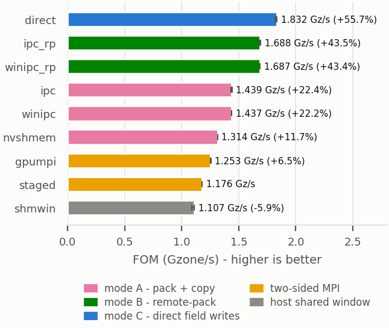
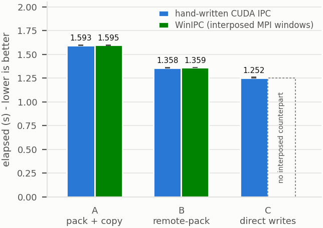

# LULESH-CUDA with Pluggable Halo-Exchange Backends

LLNL's CUDA LULESH with its 26-neighbor halo exchange refactored into a
compile-time backend API. The pack/unpack logic in `src/lulesh-comms*.cu`
is identical for every variant; each backend defines only *how bytes move*
in one header under `src/comm/`. One binary per variant, all built from
`src/Makefile` (`make all`), all reproducing the staged baseline's reported
Final Origin Energy on the full sedov run.

## The six variants

| Variant | Binary | Build flags | Halo data path | LD_PRELOAD |
|---------|--------|-------------|----------------|------------|
| staged | `lulesh_staged` | *(none)* | GPU → host staging → `MPI_Isend/Irecv` → host → GPU | no |
| gpumpi | `lulesh_gpumpi` | `COMM_GPUMPI` | device pointers passed straight to CUDA-aware MPI | no |
| shmwin | `lulesh_shmwin` | `COMM_SHMWIN` | GPU → peer's slice of an `MPI_Win_allocate_shared` host window → GPU; `Win_sync` + barriers | no |
| ipc | `lulesh_ipc` | `COMM_IPC` | one D2D copy into the peer GPU's recv buffer via explicit `cudaIpcOpenMemHandle` mapping | no |
| mpiwrap | `lulesh_mpiwrap` | `COMM_IPC IPC_VIA_MPIWRAP` | same data path as ipc, but the app only writes portable `MPI_Win_allocate` + `MPI_Win_shared_query`; the LD_PRELOADed `libmpiwrap.so` interposer supplies CUDA IPC (single node) or CUDA fabric handles (multi-node NVLink) underneath | **yes** |
| nvshmem | `lulesh_nvshmem` | `COMM_NVSHMEM` | `nvshmemx_putmem_on_stream` into symmetric-heap recv buffers | no |

The one-sided variants (shmwin / ipc / mpiwrap / nvshmem) post no receives:
the sender computes the destination offset inside the *receiver's* recv
buffer with `shmRecvOffset()` (which replays `CommRecv`'s message-ordering
bookkeeping for the receiver's boundary booleans) and writes the data there
directly. The init-time nodalMass exchange stays host-packed plain MPI in
every variant; one-sided backends activate afterwards (`g_commActive`).

**Synchronization (IPC/mpiwrap family)** is per-neighbor, not global:
zero-byte token messages mirror the original send/recv matching. Receivers
post zero-byte Irecvs in the same `recvRequest` slots real messages used —
so the unpack routines' per-message `MPI_Wait`s become genuine arrival
sync unchanged — plus a "buffer free" token (tag `msgType+1`) to each
in-neighbor; senders wait for that before putting and send a "delivered"
token (tag `msgType`) after their stream sync. Cost is O(neighbors) per
phase and scales with node count, where a barrier costs O(all ranks).
shmwin and nvshmem keep barrier epochs (node-bounded and NVSHMEM-native
respectively), as does direct — mode B's field-readiness dependency is
global, not per-neighbor.

**Hybrid transport**: `d_peerRecv[r] == NULL` is a valid state meaning
"rank r is not IPC-reachable." Same-node is *attempted* via IPC, not
assumed reachable: a `cudaIpcOpenMemHandle`/`shared_query` failure falls
back rather than aborting, because same-node doesn't always mean
peer-accessible — an 8-GPU NVL node here is two 4-GPU NVLink islands with
no P2P across them (confirmed via `nvidia-smi topo -m`), a real case this
now handles, not just the cross-node one. Unreachable peers fall back to
real MPI send/recv of the same packed messages, with receives posted into
the device recv buffer — so mixed runs (IPC within an island or node, MPI
across islands or nodes) work with unchanged unpack logic. The fallback
passes device pointers to MPI and therefore needs a working CUDA-aware
MPI; it's dead code on hardware where every peer is reachable (e.g. a
single NVSwitch domain), which is every environment tested so far.

The same failure-checked, per-peer fallback now also exists in
`transpose_ipc.cu` (modes 0 and 1) and `stencil_ipc.cu` — neither checked
`MPI_Win_shared_query`'s return value before this fix, so a failure left
the peer pointer at its zero-initialized value and a later kernel wrote
through it unconditionally: a silent illegal-memory-access that can hang
or fault a GPU rather than a diagnosable error. `direct_single` (all
peers handled in one kernel launch, which can't mix transports
mid-launch) aborts with a clear message instead if any peer is
unreachable.

Known limitation shared by all of these: the fallback decision assumes
IPC reachability is *symmetric* per GPU pair (if my query for you
succeeds, I assume your query for me also succeeds, and skip exchanging
an explicit reachability mask). True for real P2P link failures — islands,
missing fabric handles — but not guaranteed for other failure causes
(e.g. resource exhaustion on only one side), where an asymmetric failure
could deadlock instead of falling back cleanly. A fully robust version
would allgather each rank's per-peer success bitmap and have both sides
agree before choosing IPC vs. MPI for a pair. The MPI fallback also
passes device pointers to `MPI_Isend`/`Irecv`/`Send`/`Recv`, so it
requires a working CUDA-aware MPI; it is dead code (never exercised) on
any hardware tested so far, since every peer has been reachable.

## The three send modes (IPC/mpiwrap family)

| Mode | Binaries | Build flags | What happens per message |
|------|----------|-------------|--------------------------|
| A — pack + copy | `lulesh_ipc`, `lulesh_mpiwrap` | *(default)* | pack kernel → local staging buffer → one D2D copy into the peer's packed recv buffer → receiver unpacks |
| C — remote-pack | `lulesh_ipc_rp`, `lulesh_mpiwrap_rp` | `+ IPC_REMOTE_PACK` | pack kernel writes **directly into the peer's packed recv buffer** (no local staging, no separate copy); receiver unpack unchanged |
| B — direct | `lulesh_direct` | `COMM_IPC COMM_DIRECT` | **no pack, no unpack**: one fused kernel per message reads the sender's strided boundary values and writes them into the receiver's field arrays at the mirrored halo positions |

Mode B details:
- **Framing:** `lulesh_direct` has **no mpiwrap counterpart**, so it is
  evidence for the *peer-write capability ceiling* — what a general peer
  pointer lets a kernel do that point-to-point MPI cannot express — and
  **not** a measurement of interposed performance. Only the matched A and C
  pairs support claims about abstraction transparency.
- Swaps `lulesh-comms-gpu.cu` for `lulesh-comms-direct.cu` at build time and
  premaps all nine persistent nodal fields (`x,y,z,xd,yd,zd,fx,fy,fz`) of
  every peer via CUDA IPC at setup.
- Force summation (SBN) uses `atomicAdd`: up to seven neighbors legitimately
  contribute to a shared edge/corner node, and non-atomic cross-GPU `+=`
  would lose updates. Summation order changes, so the last digits of the
  energy may deviate from the packed variants.
- Position/velocity sync uses plain stores (overlapping writers carry the
  value of the same physical node).
- MonoQ cannot go direct: its destinations (`delv_xi/eta/zeta`) are per-step
  pool allocations whose addresses cannot be premapped, so MonoQ remote-packs
  into the peer's packed recv buffer and unpacks locally.
- Needs stronger synchronization (device-sync + barrier on entry to every
  send, stream-sync + barrier on exit) and supports only the structured
  `-s` path (the `-u` path never calls `SetupCommBuffers`).

## Portability: multi-node NVLink (GB200/GH200 NVL-class)

The mpiwrap abstraction is what makes rack-scale NVLink reachable without
touching the application: `lulesh_mpiwrap` speaks only `MPI_Win_allocate`
+ `MPI_Win_shared_query`, and the interposer picks the transport at
runtime. On a single node it exchanges legacy CUDA-IPC handles (validated
here). When the window's communicator spans nodes and the GPUs support
`CU_MEM_HANDLE_TYPE_FABRIC` (NVL72-class systems with the IMEX daemon),
it instead allocates via `cuMemCreate`, exchanges **fabric handles**, and
maps every peer with `cuMemMap` — same `shared_query` semantics, NVLink
loads/stores across node boundaries. The fabric branch is implemented and
compiled but dormant on nvwulf (no multi-node NVLink here); it aborts
with a clear message on systems with neither. The explicit `ipc`,
`shmwin`, and `direct` backends remain single-node by construction.
Untested caveats on a real NVL72: `-arch=sm_100` rebuild, aarch64 host
toolchain, and LULESH's cubic rank counts vs 4-GPU OS instances.

## Hardware: the nvwulf cluster (Stony Brook IACS)

GPU-to-GPU interconnect differs per node type, which matters for every
one-sided variant here ([cluster page](https://rci.stonybrook.edu/HPC/nvwulf/about)
lists nodes but not interconnect; the table below is from Slurm node
records, `nvidia-smi` device names in run logs, and `nvidia-smi topo -m`):

| Partition | Nodes | GPUs per node | GPU-to-GPU interconnect |
|-----------|-------|---------------|--------------------------|
| `h200x8` | h200x8-03 | 8× H200 **SXM** (192 CPUs, ~2.2 TB) | NVSwitch: all-to-all NVLink |
| `h200x8` | h200x8-01/02/04 | 8× H200 **NVL** (64 CPUs, ~1.4 TB) | two 4-GPU NVLink islands (GPUs 0–3 and 4–7, all-to-all NV6 within an island, one island per socket); every cross-island pair is `SYS` = PCIe + UPI, no NVLink |
| `h200x4` | h200x4-[01-04] | 4× H200 NVL | single socket; likely one 4-GPU NV6 island (not probed) |
| `b40x4` | b40x4-[01-09] | 4× RTX PRO 6000 Blackwell | **no NVLink** — P2P is PCIe only (`NODE`/`SYS` in `nvidia-smi topo -m`) |

Two consequences:

- The `h200x8` partition is **heterogeneous**: a job may land on the SXM
  node or an NVL node, and `nvidia-smi topo -m` differs between them.
  Record the node (or GPU name: "H200" = SXM, "H200 NVL" = NVL) with any
  number you intend to compare.
- On `b40x4` the IPC/NVSHMEM variants still run, but all peer traffic is
  PCIe — expect very different ratios than the H200 results below.
- On the NVL nodes with the 2×2×2 rank decomposition, the plane-direction
  halos — the largest messages — connect rank i to rank i+4, i.e. GPU
  islands 0–3 to 4–7: **the biggest transfers ride PCIe + UPI, not
  NVLink**. The results below were measured under that constraint.

## Results

Full sedov run (`-s 45`, 3145 iterations to t=0.01), 8 ranks on
**h200x8-03 (8× H200 SXM, NVSwitch all-to-all)**, OpenMPI 4.1.8 with
**UCX default transport selection** (`UCX_TLS` deliberately unset).
**Job 60150.** Authoritative machine-readable rows, with full provenance in
the header block: **`results/lulesh_results.csv`**. Both figures below are
generated from that file by `plots/make_lulesh_plots.py` — no values are
hard-coded in the generator, so figure and data cannot drift apart. The raw
log is retained locally as an audit trail but is deliberately not tracked
(`.gitignore` excludes `*.out` repo-wide); see `results/raw/README.md`.

**All nine variants passed correctness**: identical reported Final Origin
Energy (`1.482403e+06` at the log's `%12.6e` precision) over the full run,
including `direct`, whose atomicAdd reordering stayed below printed
precision. **All nine variants are now reported**: gpumpi was previously
deferred to an appendix on the strength of numbers taken under UCX
pinning; under defaults it beats staged, so that exclusion no longer
holds.

**Headline: no measurable steady-state penalty from the interposer.**
Matched pairs agree to **within 0.4% in both modes** where a counterpart
exists. Using elapsed times recovered at full precision from the log's
`%10.8g` grind-time field (the `Elapsed time` field prints only two
decimals, so it cannot resolve these gaps):

| Mode | hand-written | interposed | delta |
|------|-------------:|-----------:|------:|
| A — pack + copy   | `ipc` 1.59228 s | `mpiwrap` 1.59721 s | **+0.310%** |
| C — remote-pack   | `ipc_rp` 1.36079 s | `mpiwrap_rp` 1.36011 s | **−0.050%** |

Note mode C's interposed variant is marginally *faster*, which is why
these should be described as agreeing within 0.4% rather than as
identical: the residual is run-to-run noise, not a measured cost.

**Scope of this claim.** The LULESH timer starts at `lulesh.cu:4816`,
*after* `NewDomain` (4773, which reaches `SetupCommBuffers` → the window
and peer-pointer setup) and *after* the initial nodal-mass exchange
`CommSBN` (4788). The timed region is therefore steady-state solve only:
window construction, handle exchange, lazy peer mapping and teardown are
all excluded. This result says the interposer imposes no measurable
penalty **per iteration**; it does not measure lifecycle or setup
overhead, and must not be described as the interposer being "free". The
stencil and transpose timed regions exclude their setup on the same basis,
so the same narrower wording applies to all three case studies.

`direct` establishes the peer-write capability ceiling (see the mode-B note
below); the matched A/C pairs are the direct evidence for abstraction
transparency.

Job 60150, h200x8-03 (SXM/NVSwitch all-to-all), 8 ranks, `-s 45`, full
sedov run to t=0.01, 3145 iterations, **UCX defaults** (`UCX_TLS` unset).
Percentages are throughput gain, `staged/variant − 1`, which equals the
FOM ratio; time reduction is the smaller figure (e.g. `direct` is +56.8%
z/s, equivalently 36.2% less time).

**UNITS WARNING for FOM.** LULESH's own printout is misleading. `lulesh.cu:4707`
emits `1000.0/grindTime2` labelled `(z/s)`, but `grindTime2` is in
**microseconds** per zone per cycle, so the printed value is the true rate
divided by 1000. The column below reproduces the printed value verbatim. The
**true** rate for `direct` is 729,000 zones x 3,145 cycles / 1.25024 s =
**1.834e9 zone-updates/s**, i.e. 1.834 **G**zone/s, not 1.834 Mzone/s.
Sanity check: 1.834e9 over 8 GPUs is 229 M zone-updates/s per GPU, which is
plausible for an H200; 1.834e6 would be 229 *thousand* per GPU, which is not.
If a paper or table rescales this column, label it **Gzone/s**.

| Variant | Mode | Elapsed (s) | ms/iter | FOM as printed (see units warning) | vs staged |
|---------|------|------------:|--------:|----------:|----------:|
| direct     | B | 1.25 | 0.397 | 1,833,814 | +56.8% |
| ipc_rp     | C | 1.36 | 0.433 | 1,684,837 | +44.1% |
| mpiwrap_rp | C | 1.36 | 0.433 | 1,685,677 | +44.1% |
| ipc        | A | 1.59 | 0.506 | 1,439,888 | +23.3% |
| mpiwrap    | A | 1.60 | 0.509 | 1,435,439 | +22.5% |
| nvshmem    | A | 1.74 | 0.553 | 1,315,001 | +12.6% |
| gpumpi     | — | 1.83 | 0.582 | 1,250,391 |  +7.1% |
| staged     | — | 1.96 | 0.623 | 1,169,930 | baseline |
| shmwin     | — | 2.07 | 0.658 | 1,107,443 |  −5.3% |

**Supersedes job 46979**, which exported
`UCX_TLS=self,sm,cuda_copy,cuda_ipc`. That pinning inflated staged from
1.96 s to 3.56 s while moving every other variant ≤10%, so every
speedup-vs-staged figure shifted. Three consequences worth stating:
`direct` drops from 2.78× to +56.8% (1.57×); **`shmwin` flips sign** —
previously reported 1.70× *faster* than staged, it is in fact ~5%
*slower*, which is unsurprising for a backend that stages through a
**host** window; and gpumpi moves from excluded to competitive.





Takeaways:

- **Each mode step pays off**: remote-pack (C) removes the local staging
  copy and gains 17% over pack+copy (A) (1.59 → 1.36 s); direct field
  writes (B) also remove the unpack and gain another 8% (1.36 → 1.25 s).
- **Node type matters**: mode A ipc measured 1.75 s on all-to-all SXM
  under the older pinned configuration vs 1.94 s on an NVL node, where the
  plane-direction halos cross the 4-GPU-island boundary over PCIe + UPI
  (~10% penalty). Not yet re-measured on an NVL node under defaults.
- **Host staging is not the floor.** Under defaults staged (1.96 s) beats
  `shmwin` (2.07 s) and trails `gpumpi` (1.83 s) by only 7%. The gap to the
  IPC family is real but far smaller than the pinned numbers suggested.

Caveats:

- Single-run numbers at one problem size; quote with that caveat.
- UCX transports are **no longer pinned** for these runs; the table above
  is job 60150 under defaults. The paragraph below documents the pinning
  that produced the superseded job 46979 numbers, and is retained because
  the rationale for it was wrong in an instructive way.
  **A previous revision of this line claimed the UCX *default*
  selection "can slow even host-staged MPI by large factors". That is
  backwards and no data here supports it.** Measured evidence points the
  other way: in job 59070, restricting `UCX_TLS` cost host-staged transpose
  2.6x at 16384² (96.0 -> 37.3 GB/s), and within job 46508 itself
  `staged_default_45_200` was the *fastest* staged case (0.14 s) while the
  restricted `staged_ucx_self_sm_45_200` failed outright (rc=1). The pinning
  was originally adopted to work around gpumpi's apparent slowness, which is
  now attributed to a fixed setup cost rather than transport selection.
  **`UCX_TLS` is no longer exported** — it was removed from
  `run_lulesh.sbatch` and `run_lulesh_verify.sbatch` on 2026-08-04. The
  numbers in this file were taken under the old pinned configuration, but for
  LULESH that appears to matter little: job 46508 ran the same binary both
  ways and `gpumpi_default_45_200` (UCX defaults, 3.84 s) vs
  `gpumpi_ucx_tls_only_45_200` (pinned, 3.79 s) differ by 1.3%. Consistent
  with the penalty being large-message-specific — transpose stages ~512 MiB
  per exchange, whereas a LULESH face at `-s 45` is 45² × 8 B per field, i.e.
  47.5 KiB for the 3-field MonoQ exchange and 94.9 KiB for the 6-field
  x/y/z/xd/yd/zd exchange (`lulesh-comms.cu:1243,1665`). So these numbers are
  **not known to be wrong**; re-measuring under defaults is worth doing for
  provenance consistency, not because the values are suspect. Verification is
  also not expected to be affected: a correct transport implementation should
  preserve numerics, and every configuration tested in job 46508 produced
  matching energy. Note this is an empirical claim, not a guarantee — the
  `direct` backend's `atomicAdd` force summation can legitimately reorder
  accumulation and perturb the last digits (see the SBN note above); it simply
  stayed below the log's `%12.6e` printed precision in these runs.
- One staged run aborted with a Volume Error on freshly rebooted
  h200x8-03 and passed on rerun — treat isolated failures there with
  suspicion.

### Appendix: gpumpi (CUDA-aware MPI) — one-time setup cost, not a broken path

**This section was rewritten 2026-07-28. The previous version claimed
CUDA-aware MPI through UCX was "misconfigured or broken on this system."
That conclusion was wrong, and the reasoning behind it was wrong in a
specific, reproducible way: a large one-time connection-setup cost was
divided by the iteration count and mistaken for per-iteration overhead.**

gpumpi is correct (energy matches staged at every size) and, once
connected, *faster than staged MPI*. The evidence is the UCX experiment
sweep in `ucx_lulesh_experiments_46508/` (job 46508, 8 ranks, size 45),
which happens to contain two different iteration counts for the same
configuration and so permits a fixed/marginal decomposition. Using the
**matched** `memcache_off` pair (200-iter 3.79 s, full 5.82 s) rather than
mixing UCX configs:

| variant | total (200 iter) | total (full, ~3145 iter) | fixed cost | marginal ms/iter |
|---------|------------------|--------------------------|-----------|------------------|
| gpumpi  | 3.79 s           | 5.82 s                   | **3.65 s**| **0.689**        |
| staged  | 0.17 s           | 2.45 s                   | 0.015 s   | 0.774            |
| ipc     | 0.14 s           | 1.96 s                   | 0.016 s   | 0.618            |

(An earlier revision paired `gpumpi_default_45_200` with the `memcache_off`
full run — a mixed-config pair — giving 3.71 s / 0.672 ms. The conclusion is
insensitive to this: every gpumpi 200-iteration run in job 46508 falls in
3.79–4.01 s regardless of UCX setting.)

Two caveats on this table, both from reading the case definitions in
`run_lulesh_ucx_experiments.sbatch`:

- **It is a cross-transport comparison.** The gpumpi and ipc rows are UCX
  (`--mca pml ucx`), but the staged rows come from `staged_ob1_*`, which ran
  `--mca pml ob1 --mca btl self,vader,tcp` and bypasses UCX entirely. Each
  variant's own 200-iter/full pairing is internally matched, so the
  decompositions are individually valid, but "gpumpi vs staged" is comparing a
  UCX path against an ob1/vader path.
- **The gpumpi rows are from the pinned + `UCX_MEMTYPE_CACHE=n` case**, since
  that is the only gpumpi *full* run job 46508 recorded. A fully-default
  decomposition is not available from this data. It matters little given
  default and pinned differ by 1.3% at 200 iterations, but a clean re-run
  under defaults would remove the caveat.

In steady state the marginal cost per iteration is gpumpi 0.689 ms, staged
0.774 ms, ipc 0.618 ms. As ratios, to avoid percentage-convention ambiguity:
gpumpi is **1.12× faster than staged** (0.774/0.689) and **1.11× slower than
ipc** (0.689/0.618). The "19–20 ms/iter" that the 200-iteration sweep reports
for gpumpi is 3.65 s of one-time cost ÷ 200. That is also why gpumpi looks
flat at 19.2 → 20.1 ms/iter across sizes 45 → 100 while ipc scales
0.70 → 1.25: a constant divided by a constant.

A similar-looking artifact was found in the stencil benchmark (~0.26 s fixed
cost), but **that one turned out to be caused by exporting
`UCX_TLS=self,sm,cuda_copy,cuda_ipc` and disappears under UCX defaults**
(job 59853: GPU-aware stencil is already converged at warmup=1 and ties IPC).
LULESH's cost is *not* explained that way — `gpumpi_default_45_200` was
already a UCX-default run and still shows 3.84 s / 19.2 ms-per-iter. So
LULESH's fixed cost is a genuine, still-unexplained phenomenon rather than a
transport-pinning artifact. Distinguishing candidates, none yet tested:

- **Peer count -- but this does not fully account for it.** At the evaluated
  2x2x2 decomposition there are 8 domains, so LULESH's 26 halo *directions*
  collapse onto only **7 distinct peer ranks** (26 is the message count per
  phase, not the peer count; an earlier revision of this file conflated the
  two). Against the stencil's 2 neighbours that is 3.5x the peers for ~14x the
  fixed cost, so peer count alone is insufficient -- something else, or
  something superlinear, is involved. Untested.
- **`cudaHostRegister`** of `commDataRecv` in `commAllocRecv` (this file's
  backend), which the stencil has no equivalent of.
- Whatever also produces the teardown context errors described below.

See `results/stencil_results.txt` for the stencil re-baseline and the
reasoning that separates the two cases.

Three specific claims in the previous version were factually wrong:

- **"emitted per message"** — the `cuCtxGetApiVersion` count is ~1025
  whether the run does 200 iterations or 3145. A fixed count, not
  per-message.
- **The errors are not in the run at all.** In
  `gpumpi_default_45_200.log`, `Elapsed time` prints at line 22 and the
  errors span lines 26–1057. Every one is emitted *after* the solve
  finished — pure teardown noise, outside the timed region.
- **"silenced by `UCX_LOG_LEVEL=error`"** — an `UCX ERROR`-level message
  is not suppressed at log level `error`. The CSV shows it was
  `gpumpi_ucx_log_fatal` (level `fatal`) that produced 0 errors, and that
  run was *slower* (4.01 s vs 3.84 s), confirming the errors are cosmetic
  and unrelated to the timing.

The previous version was right that UCX knobs don't help: `default`
3.84 s, `tls_only` 3.79, `memcache_off` 3.79, `no_dmabuf` 3.80 — all
within noise. But that is because none of them addresses a *setup* cost.

Two genuine anomalies remain, both distinct from the data path:

1. **~3.65 s of one-time setup inside the reported elapsed time.** Scales
   plausibly with peer-connection count. Survives under UCX defaults, unlike
   the stencil's superficially similar cost.
2. **~1025 invalid-context errors at teardown.** Every backend calls
   `cudaDeviceReset()` before `MPI_Finalize()` (see `lulesh.cu:4875-4881`),
   but gpumpi is the only variant where UCX still holds CUDA *device*
   memory registrations and IPC mappings at that moment — staged registers
   host memory, nvshmem uses `nvshmem_finalize()`, and the IPC family tears
   down its own mappings. So UCX cleans up against a context that has
   already been destroyed. Reordering the teardown is the obvious fix and
   has not yet been tried.

Neither anomaly means the transport is broken. gpumpi's numbers should be
reported with the fixed/marginal split above rather than excluded.

## File map

```
LULESH/
├── run_lulesh.sbatch              # benchmark sweep: all 9 binaries × sizes 45–100 × 200 iters,
│                                  #   energy/elapsed/FOM summary per size
├── run_lulesh_verify.sbatch       # verification: all 9 binaries, full run to t=0.01,
│                                  #   energy cross-check against staged
├── README                         # upstream LLNL readme
├── cuda/
│   ├── README.md                  # this file
│   └── src/
│       ├── lulesh.cu              # solver; calls commAllocRecv/commTeardown + COMM_RUNTIME_* hooks
│       ├── lulesh.h               # Domain (incl. per-backend comm state); includes comm/comm_backend.h
│       ├── lulesh-comms.cu        # host-side CommRecv/CommSend/CommSBN (init exchange), backend-agnostic
│       ├── lulesh-comms-gpu.cu    # GPU pack/unpack for all packed-buffer backends, backend-agnostic
│       ├── lulesh-comms-direct.cu # Mode B: fused remote-write kernels (replaces lulesh-comms-gpu.cu)
│       ├── comm/
│       │   ├── comm_backend.h     # compile-time dispatch, shmRecvOffset(), host-send hook defaults
│       │   ├── comm_staged.h      # baseline two-sided MPI with host staging
│       │   ├── comm_gpumpi.h      # CUDA-aware MPI (device pointers)
│       │   ├── comm_shmwin.h      # MPI shared-memory window + Win_sync barriers
│       │   ├── comm_ipc_common.h  # packed-buffer mapping + transfer macros shared by the
│       │   │                      #   IPC family; modes A and C live here
│       │   ├── comm_ipc.h         # explicit cudaIpc handle exchange
│       │   ├── comm_mpiwrap.h     # MPI_Win_create + shared_query, backed by libmpiwrap.so
│       │   ├── comm_direct.h      # Mode B setup: peer field mappings (+ packed buffer for MonoQ)
│       │   └── comm_nvshmem.h     # NVSHMEM symmetric heap + putmem_on_stream
│       ├── Makefile               # targets: staged gpumpi shmwin ipc mpiwrap nvshmem
│       │                          #          ipc_rp mpiwrap_rp direct   (make all builds all 9)
│       ├── allocator.cu/.h        # upstream device-memory pool
│       ├── vector.h util.h sm_utils.inl   # upstream support code
│       └── sedov*.lmesh           # upstream sample meshes (-u path, untested with these backends)
└── omp_4.0/ openacc/ stdpar/      # unmodified upstream LULESH programming-model variants
```

## Build & run

```bash
cd LULESH/cuda/src
make all                # or any single target, e.g. make mpiwrap_rp

# mpiwrap flavors need the interposer at runtime; everything else runs plain
MPIWRAP=~/mpiwrap/mpi-intercept/libmpiwrap.so
mpirun -np 8 ./lulesh_staged -s 45
LD_PRELOAD=$MPIWRAP mpirun -np 8 ./lulesh_mpiwrap -s 45

# or the harnesses (build + run + energy cross-check, UCX defaults):
sbatch LULESH/run_lulesh_verify.sbatch   # correctness, full-length run
sbatch LULESH/run_lulesh.sbatch          # size sweep benchmark
```

Rank count must be a cube (8 = 2×2×2). NVSHMEM requires one rank per GPU;
the other variants also run with ranks sharing a GPU.
